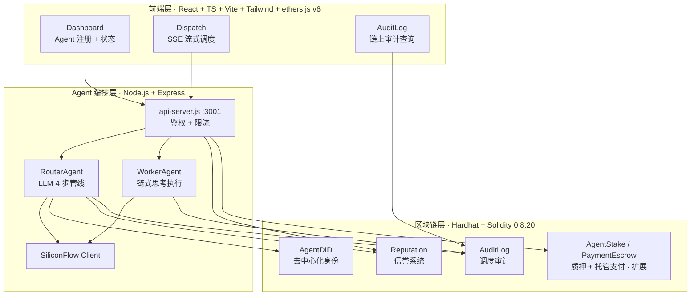
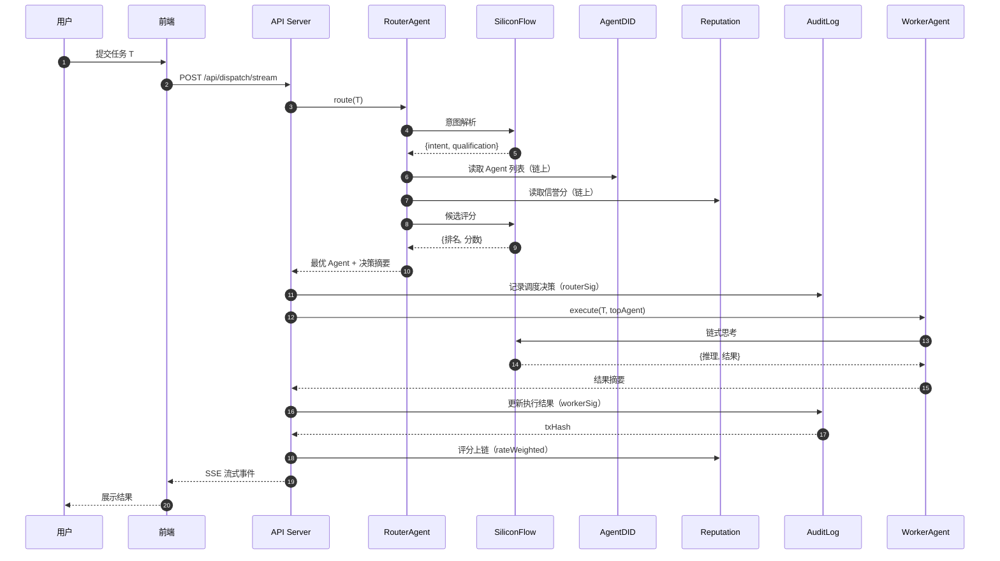

# ORACLE — On-chain Reputation & Audit for Coordinated LLM-Agent Execution


ORACLE 是一个将 **LLM 驱动的 Agent 调度** 与 **链上信任、审计机制** 相结合的系统，聚焦可信路由与审计追溯。Router Agent 通过链上身份、信誉数据驱动调度决策，Worker Agent 执行任务，全过程不可篡改地记录上链。

> 命名：**ORACLE** = **O**n-chain **R**eputation & **A**udit for **C**oordinated **L**LM-Agent **E**xecution。同时呼应区块链领域中"预言机（oracle）"作为链上链下桥梁的语义——正对应本系统中 LLM-Agent 与链上信任层之间的桥接定位。

## 系统架构



> 三个核心合约 `AgentDID` / `AuditLog` / `Reputation` 构成可信路由与审计的主链路；`AgentStake`、`PaymentEscrow` 等为质押与支付扩展。

## 技术栈

| 层 | 技术 |
| --- | --- |
| **前端** | TypeScript · React 18 · Vite · Tailwind CSS · ethers.js v6 |
| **后端 Agent** | Node.js · Express · SiliconFlow LLM API |
| **区块链** | Hardhat · Solidity 0.8.20（本地网络 localhost:8545, chainId 31337） |
| **核心机制** | DID 身份（ZKP 模拟）· 链上审计日志 · 信誉评分系统 |

## 项目结构

```text
oracle/
├── contracts/              # Solidity 智能合约
│   ├── AgentDID.sol        # Agent 去中心化身份 + 资质承诺验证
│   ├── AuditLog.sol        # 调度决策审计追溯
│   └── Reputation.sol      # 链上信誉分管理
├── agents/                 # Node.js 后端 Agent 层
│   ├── api-server.js        # Express API：调度 / 评分 / 信誉 等端点（含鉴权 + 限流）
│   ├── router-agent.js      # Router：意图解析 → 候选筛选 → LLM 评分 → 选择
│   ├── worker-agent.js      # Worker：链式思考执行任务，按复杂度选模型
│   ├── reputation-analyzer.js  # 百分制信誉评分分析（0-100）
│   └── siliconflow-client.js   # SiliconFlow LLM API 封装
├── frontend/               # React 前端
│   └── src/
│       ├── contracts/abis.ts   # 合约 ABI 绑定
│       ├── utils/did.ts        # DID / 资质承诺工具
│       ├── pages/
│       │   ├── Dashboard.tsx   # Agent 注册 + 状态展示
│       │   ├── Dispatch.tsx    # 任务调度追踪
│       │   └── AuditLog.tsx    # 审计日志查询
│       └── App.tsx             # Tab 路由
├── scripts/deploy.js       # 合约部署脚本
├── test/                   # Hardhat 测试 + E2E 测试
└── paper/                  # 配套学术论文（LaTeX 源 + PDF + Word）
```

## 快速开始

### 1. 启动 Hardhat 本地网络

```bash
npm install
npx hardhat node
```

### 2. 部署合约

新开终端，部署后会自动写入 `frontend/src/contracts/addresses.json`：

```bash
npx hardhat run scripts/deploy.js --network localhost
```

### 3. 启动后端 Agent API

```bash
cd agents
npm install
node api-server.js          # Express API on :3001
```

> 需配置环境变量（参考 `.env.example`）：`SILICONFLOW_API_KEY`（LLM 调用，必需）、`ROUTER_SIGNER_PRIVATE_KEY` / `REPUTATION_SIGNER_PRIVATE_KEY`（上链签名）、`API_ACCESS_KEYS`（API 鉴权，可选）。

### 4. 启动前端

```bash
cd frontend
npm install
npm run dev                 # Vite dev server on :5173
```

打开 <http://localhost:5173>

## 数据流

1. **Dashboard** → 注册 Agent：`AgentDID.registerAgent()` 上链（DID + 资质承诺）
2. **Dispatch** → 提交任务：前端调用 `/api/dispatch`
3. **Router Agent** → 读取链上 Agent 列表与信誉分，LLM 评分（`score = 0.6·q + 0.4·rNorm`，q∈{60,40} 为资质匹配度，rNorm 为信誉归一化），选出最优 Agent；LLM 失败时回退到同权重的规则匹配
4. **Worker Agent** → LLM 链式思考执行任务（按复杂度选模型：长文/含「分析·计算·创作」→ DeepSeek-V3，否则 Qwen2.5-7B），返回结果与推理过程
5. **API Server** → 将调度决策与执行结果写入 `AuditLog` 合约
6. **Audit Log** → 前端直接从链上读取完整调度记录（transactionHash 可验证）



## 核心机制

### DID 身份（AgentDID）

- 注册时：生成 DID + 资质承诺 `commitment = keccak256(abi.encodePacked(nullifier, secretHash))`
- 验证时：提交 nullifier + secretHash，合约验证 `keccak256(abi.encodePacked(nullifier, secretHash)) == commitment`
- 模拟 ZKP：资质"承诺-证明"模式，nullifier 防止重复使用，不上链真实零知识证明

### 审计追溯（AuditLog）

- 所有调度决策上链：`timestamp、requester、targetAgent、decisionReason、executionResult`
- 支持按 Agent、请求方、时间范围查询
- transactionHash 可验证完整链路，记录不可篡改

### 信誉系统（Reputation）

- 任务完成后调用方评分，百分制（`MIN_RATING=0` ~ `MAX_RATING=100`）
- 加权平均：评分者按自身信誉的平方根加权（`weight = sqrt(raterAvg)`），抑制低信誉刷分
- `isReliable()` 要求加权平均分 ≥ 60 且评分数 ≥ 3；另有 `timeDecayed()` 时间衰减与 `isReliableWeighted()` 变体
- Router 调度决策查询链上信誉分作为参考，含降权惩罚（`penalty`）机制

## API 端点

后端 Express 服务（`:3001`）。`/api/dispatch`、`/api/dispatch/stream`、`/api/user-rating` 受 `x-api-key` 鉴权 + 限流保护（通过 `API_ACCESS_KEYS` 配置；为空则关闭鉴权）。

| 方法 | 路径 | 说明 |
| --- | --- | --- |
| POST | `/api/dispatch` | 阻塞式任务调度执行 |
| POST | `/api/dispatch/stream` | 流式执行（SSE，含信誉分析） |
| POST | `/api/user-rating` | 用户对任务结果评分 |
| GET | `/api/reputation/summary` | 链上信誉概况 |
| GET | `/api/scoring-dimensions` | 评分维度说明 |
| GET | `/api/agent-types` | Agent 类型列表 |
| GET | `/api/dispatch/history` | 调度历史 |
| GET | `/api/health` | 健康检查 |

## 测试

```bash
npx hardhat test            # 合约单元测试
node test/e2e-test.js       # E2E 全流程测试（需先启动所有服务）
```

合约测试覆盖：注册、验证、调度、评分四个核心路径。

## 配套论文

`paper/` 目录包含课程论文《基于区块链的 LLM Agent 调度系统：可信路由与链上审计机制研究》：

- `paper-academic.tex` — LaTeX 源（ctexart + xeCJK）
- `基于区块链的LLM_Agent_调度系统_可信路由与链上审计机制研究.pdf` — 最终 PDF 交付物
- `基于区块链的LLM_Agent_调度系统_可信路由与链上审计机制研究.docx` — Word 交付物
- `figures/`、`references/`、`benchmark.json`、`gas-report.txt` — 配图、参考文献与实测数据
