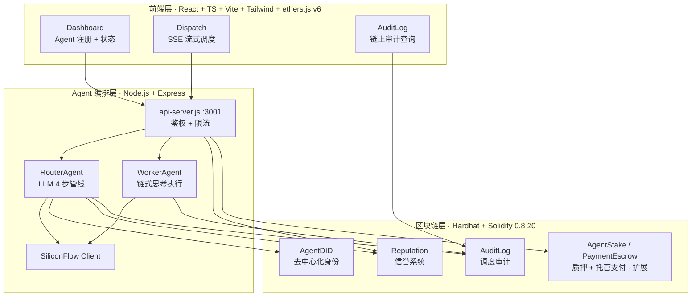
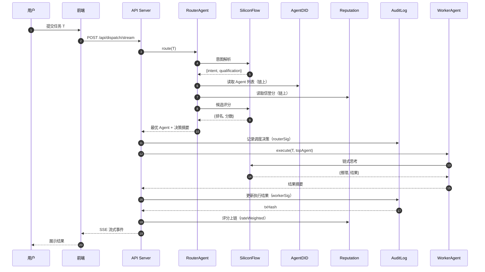

# ORACLE — On-chain Reputation & Audit for Coordinated LLM-Agent Execution

A project of [Center for AI Services Computing (AISC)](https://github.com/Center-for-AI-Services-Computing) at Shenzhen University. Lab-wide collaboration and contribution norms: see the [lab-rules repository](https://github.com/Center-for-AI-Services-Computing/lab-rules) (organization members only).

[](https://github.com/Center-for-AI-Services-Computing/ORACLE/actions/workflows/ci.yml)


**ORACLE** binds an LLM-driven agent dispatch to an on-chain trust and audit layer. When a router agent at one organization selects a worker agent at another over a shared relay, ORACLE makes the dispatch itself non-repudiable: the router's decision and the worker's result are co-signed into a single dual-role **EIP-712** audit record, reconstructed and verified on-chain. The relay that submits these transactions holds **no signing key**, so it can pay gas but cannot forge or replay an attribution. A dispute over a failed task drives a stake-slashing loop into reputation, guarded by a circuit breaker that provably never slashes a successful execution.

Three Solidity contracts provide the substrate — `AgentDID` (identity via hash commit–reveal, **not** a zero-knowledge proof), `AuditLog` (dual-EIP-712 dispatch records), and `Reputation` (reputation-weighted scoring with time decay). A TypeScript backend hosts the Router/Worker agents (SiliconFlow LLMs), and a React frontend drives the flow. Reputation weighting raises the cost of naive Sybil attacks but is **not** collusion-resistant; correctness of LLM output is out of scope (a signature attests authorship, not correctness).

> A companion research paper is not yet public; the repository open-sources the system implementation only. See the Chinese sections below for full details.

---

ORACLE 是一个将 **LLM 驱动的 Agent 调度** 与 **链上信任、审计机制** 相结合的系统，聚焦可信路由与审计追溯。Router Agent 通过链上身份、信誉数据驱动调度决策，Worker Agent 执行任务，全过程不可篡改地记录上链。

> 命名：**ORACLE** = **O**n-chain **R**eputation & **A**udit for **C**oordinated **L**LM-Agent **E**xecution。同时呼应区块链领域中"预言机（oracle）"作为链上链下桥梁的语义——正对应本系统中 LLM-Agent 与链上信任层之间的桥接定位。

## 系统架构



> 三个核心合约 `AgentDID` / `AuditLog` / `Reputation` 构成可信路由与审计的主链路；`AgentStake`、`PaymentEscrow` 等为质押与支付扩展。

## 技术栈

| 层 | 技术 |
| --- | --- |
| **前端** | TypeScript · React 18 · Vite · Tailwind CSS · ethers.js v6 |
| **后端 Agent** | TypeScript（ESM，tsx 运行）· Node.js · Express · SiliconFlow LLM API |
| **区块链** | Hardhat · Solidity 0.8.20 · TypeChain 类型化合约工厂（本地网络 localhost:8545, chainId 31337；Sepolia 公测网） |
| **核心机制** | DID 身份（哈希承诺 commit-reveal，非 ZKP）· 双角色 EIP-712 审计日志 · 信誉评分系统 · 争议-罚没管线 |

## 项目结构

```text
oracle/
├── contracts/              # Solidity 智能合约
│   ├── AgentDID.sol        # Agent 去中心化身份 + 资质承诺验证
│   ├── AuditLog.sol        # 调度决策审计追溯
│   └── Reputation.sol      # 链上信誉分管理
├── agents/                 # 后端 Agent 层（ESM TypeScript，tsx 运行）
│   └── src/
│       ├── api-server.ts       # Express API：调度 / 评分 / 信誉 等端点（含鉴权 + 限流）
│       ├── router-agent.ts     # Router：意图解析 → 候选筛选 → LLM 评分 → 选择
│       ├── worker-agents.ts    # Worker：链式思考执行任务，按复杂度选模型
│       ├── reputation-analyzer.ts # 百分制信誉评分分析（0-100）
│       └── siliconflow-client.ts  # SiliconFlow LLM API 封装
├── frontend/               # React 前端
│   └── src/
│       ├── contracts/abis.ts   # 合约 ABI 绑定
│       ├── utils/did.ts        # DID / 资质承诺工具
│       ├── pages/
│       │   ├── Dashboard.tsx   # Agent 注册 + 状态展示
│       │   ├── Dispatch.tsx    # 任务调度追踪
│       │   └── AuditLog.tsx    # 审计日志查询
│       └── App.tsx             # Tab 路由
├── scripts/deploy.js       # 合约部署脚本
├── experiments/            # 成本 / 路由 / 争议实验脚本
│   └── data/               # 实验产物 JSON（gas、成本前沿、延迟等）
└── test/                   # Hardhat 合约测试 + E2E 测试
```

## 快速开始

### 1. 启动 Hardhat 本地网络

```bash
npm install
npx hardhat node
```

### 2. 部署合约

新开终端，部署后会自动写入 `frontend/src/contracts/addresses.json`：

```bash
npx hardhat run scripts/deploy.js --network localhost
```

### 3. 启动后端 Agent API

```bash
cd agents
npm install
npm start                   # Express API on :3001（tsx src/api-server.ts）
```

> 需配置环境变量（参考 `.env.example`）：`SILICONFLOW_API_KEY`（LLM 调用，必需）、`ROUTER_SIGNER_PRIVATE_KEY` / `REPUTATION_SIGNER_PRIVATE_KEY`（上链签名）、`API_ACCESS_KEYS`（API 鉴权，可选）。

### 4. 启动前端

```bash
cd frontend
npm install
npm run dev                 # Vite dev server on :5173
```

打开 <http://localhost:5173>

## 数据流

1. **Dashboard** → 注册 Agent：`AgentDID.registerAgent()` 上链（DID + 资质承诺）
2. **Dispatch** → 提交任务：前端调用 `/api/dispatch`
3. **Router Agent** → 读取链上 Agent 列表与信誉分，LLM 评分（`score = 0.6·q + 0.4·rNorm`，q∈{60,40} 为资质匹配度，rNorm 为信誉归一化），选出最优 Agent；LLM 失败时回退到同权重的规则匹配
4. **Worker Agent** → LLM 链式思考执行任务（按复杂度选模型：长文/含「分析·计算·创作」→ DeepSeek-V3，否则 Qwen2.5-7B），返回结果与推理过程
5. **API Server** → 将调度决策与执行结果写入 `AuditLog` 合约
6. **Audit Log** → 前端直接从链上读取完整调度记录（transactionHash 可验证）



## 核心机制

### DID 身份（AgentDID）

- 注册时：生成 DID + 资质承诺 `commitment = keccak256(abi.encodePacked(nullifier, secretHash))`
- 验证时：提交 nullifier + secretHash，合约验证 `keccak256(abi.encodePacked(nullifier, secretHash)) == commitment`
- 哈希承诺（commit-reveal，非零知识）：资质"承诺-证明"模式基于 `keccak256` 哈希承诺，nullifier 防止重复使用。注意：这是哈希承诺方案，**不是**零知识证明——验证时需提交 nullifier+secretHash 明文开承诺，并未隐藏 secretHash。真实 ZKP 集成列为未来工作。

### 审计追溯（AuditLog）

- 所有调度决策上链：`timestamp、requester、targetAgent、decisionReason、executionResult`
- 支持按 Agent、请求方、时间范围查询
- transactionHash 可验证完整链路，记录不可篡改

### 信誉系统（Reputation）

- 任务完成后调用方评分，百分制（`MIN_RATING=0` ~ `MAX_RATING=100`）
- 加权平均：评分者按自身信誉的平方根加权（`weight = sqrt(raterAvg)`），抑制低信誉刷分
- `isReliable()` 要求加权平均分 ≥ 60 且评分数 ≥ 3；另有 `timeDecayed()` 时间衰减与 `isReliableWeighted()` 变体
- Router 调度决策查询链上信誉分作为参考，含降权惩罚（`penalty`）机制

## API 端点

后端 Express 服务（`:3001`）。`/api/dispatch`、`/api/dispatch/stream`、`/api/user-rating` 受 `x-api-key` 鉴权 + 限流保护（通过 `API_ACCESS_KEYS` 配置；为空则关闭鉴权）。

| 方法 | 路径 | 说明 |
| --- | --- | --- |
| POST | `/api/dispatch` | 阻塞式任务调度执行 |
| POST | `/api/dispatch/stream` | 流式执行（SSE，含信誉分析） |
| POST | `/api/user-rating` | 用户对任务结果评分 |
| GET | `/api/reputation/summary` | 链上信誉概况 |
| GET | `/api/scoring-dimensions` | 评分维度说明 |
| GET | `/api/agent-types` | Agent 类型列表 |
| GET | `/api/dispatch/history` | 调度历史 |
| GET | `/api/health` | 健康检查 |

## 测试

```bash
npx hardhat test                    # 合约单元测试
cd agents && npm run typecheck && npm run lint && npm test   # 后端类型检查 + lint + 测试
node test/e2e-test.js               # E2E 全流程测试（需先启动所有服务）
```

合约测试覆盖注册、验证、调度、评分、争议-罚没等路径；后端覆盖鉴权、限流、签名与信誉分析。持续集成（GitHub Actions）在每次 push 自动运行合约 / 后端 / 前端三条流水线。

## 实验复现

`experiments/` 下的脚本用真实测量数据复现论文中的成本与路由结果，产物写入 `experiments/data/*.json`：

```bash
npx hardhat run experiments/gas-optimization.js   # 成本-可验证性前沿（gas 分解）
npx hardhat run experiments/e3-e5-onchain.js      # 归属 / 争议-罚没 / 断路器 gas
npx hardhat run experiments/e4-routing-sybil.js   # 信誉加权路由 + Sybil 分析
npx hardhat run experiments/e6-stake-weighted.js  # 质押绑定评分权重（§4.3 A 层）
npx hardhat run experiments/e1-sepolia-gas.js     # Sepolia 真实 gas 测量（需配 Sepolia RPC 与资金账户）
```

多 LLM 路由泛化实验（E7）复用生产 `RouterAgent.evaluateCandidates` 打分路径，
以确定性 `ruleScore`（论文公式 3）为 ground-truth，测不同开/闭源模型作打分器时的
Top-1 一致率、Kendall τ 排序保真与兜底率。它是 ESM/TypeScript 脚本，经 `tsx` 运行：

```bash
# 需 SILICONFLOW_API_KEY（开源模型池）；OPENAI_API_KEY 可选（GPT 等 OpenAI 兼容闭源模型，
# 经 OPENAI_BASE_URL 注入）。不可用模型自动 preflight 跳过并记入 skippedModels。
./agents/node_modules/.bin/tsx experiments/e7-multi-llm-routing.ts            # 真跑，产物 data/e7-results.json
./agents/node_modules/.bin/tsx experiments/e7-multi-llm-routing.ts --dry-run  # 校验指标管道（不调 API）
REPEAT=3 MODEL_BUDGET_S=150 ./agents/node_modules/.bin/tsx experiments/e7-multi-llm-routing.ts  # 每场景重复取多数 + 每模型墙钟预算
```

## 引用

如在研究中使用本项目，请参考仓库根目录的 [`CITATION.cff`](CITATION.cff)（GitHub 页面 "Cite this repository" 按钮会自动生成 BibTeX / APA）。

## 许可证

本项目以 [MIT License](LICENSE) 开源。

## 说明

本仓库开源 ORACLE 的**系统实现**（合约、后端 Agent、前端、实验脚本与数据）。配套学术论文暂未公开，如有需要请联系作者。

## 项目归属与协作规范

本项目属于深圳大学智能服务计算研究中心(AISC)在 GitHub 组织 [Center-for-AI-Services-Computing](https://github.com/Center-for-AI-Services-Computing) 下的研究产出。仓库所有者已通过 PR 流程完成从个人账号 `qiyueqiu/ORACLE` 向组织的转移,代码所有权归组织所有,作者署名和贡献历史保留。

实验室的协作规范、权限模型、开源流程、许可证选择等内容,见组织 [lab-rules 仓库](https://github.com/Center-for-AI-Services-Computing/lab-rules)(仅组织成员可见)。
